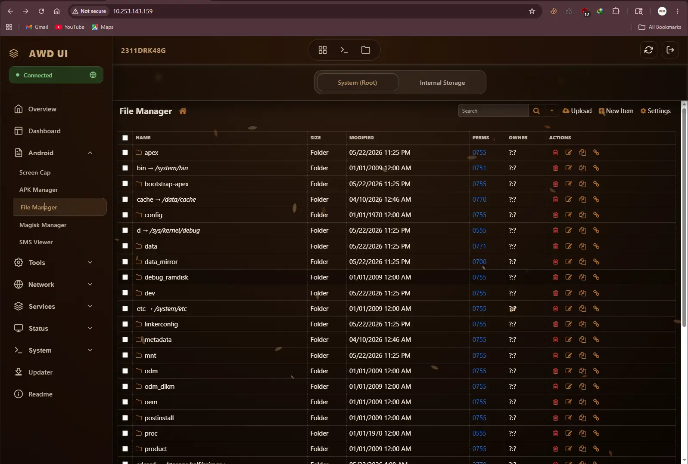

# AWD-WebUI (AreweDaks WebUI)

AWD-WebUI is an advanced, fully-featured Web Interface and backend stack for Android devices, powered by PHP 8 and integrated as a Magisk Module. It provides root-level system management, an integrated web-based terminal, APK parsing capabilities, and network utilities directly from your browser. 

> **Note**: This repository serves as the OTA (Over-The-Air) update package source code for the AWD-WebUI Magisk Module.

## 🚀 Key Features

- **PHP 8 Backend**: High-performance, lightweight backend running natively on Android via Magisk.
- **Root System Management**: Safely executes root-level operations and system configurations directly from the web interface.
- **Web Terminal (TTYD + Tmux)**: Integrated full-featured web terminal connected directly to your Termux environment. Sessions are preserved via `tmux`, allowing background tasks to continue even when you close the browser.
- **APK Manager**: Built-in tools for extracting application labels and metadata using Termux's `aapt`.
- **Broad Compatibility**: Designed to support Android 10 up to Android 16.

## 🎨 Preview

The UI is highly responsive and designed to look great on both mobile devices and desktop browsers.

### Dark Mode

### Light Mode

---

## 📩 Contact & Support

If you are interested in getting this WebUI or need support, feel free to reach out:
- Contact me on Telegram: [@AreweDaks](https://t.me/arewedaks)
- Join the Telegram Group: [RameShopp](https://t.me/RameShopp)